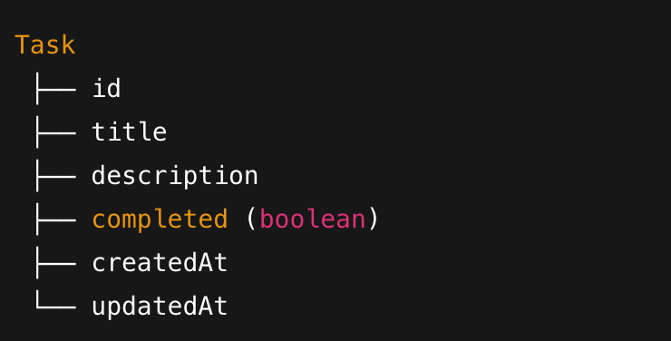
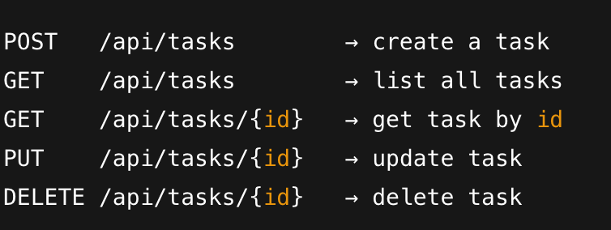

## BACKEND

Model → Repository → Service → Controller

# MODEL (Entity) — “WHAT your data LOOKS like”
- Represents your table in the database
- Model = shape + structure of your data
- blueprint/ Database table 

# REPOSITORY — “How to TALK TO the database”
- Repository is your **data access layer**
- It gives you CRUD operations without writing SQL:
   - save()
   - findById()
   - findAll()
   - delete()
   - update()
- Mental model: Repository = Database API

## SERVICE — “BUSINESS LOGIC lives here”
- This is the brain of the backend
- Service decides **how the app behaves**:
- Examples:
   - When creating a task, check if title is empty
   - Automatically set createdAt
   - Update fields based on rules
   - Filter tasks
   - Validate input
   - Throw custom exceptions
- Mental model: Service = Logic + Rules + Processing

## CONTROLLER — “ENTRY point for API”
- Controllers handle HTTP calls:
   - GET /tasks
   - POST /tasks
   - PUT /tasks/{id}
   - DELETE /tasks/{id}
- Controller does:
   - receive request from frontend
   - call service
   - return response
   - Controller should NOT contain business logic.
- It’s just a traffic manager.
- Mental model: **Controller = API Gateway**

## FULL FLOW (VERY IMPORTANT)

- When your React app calls the API:

**React → Controller → Service → Repository → Database**  

- And when data returns:

**Database → Repository → Service → Controller → React**